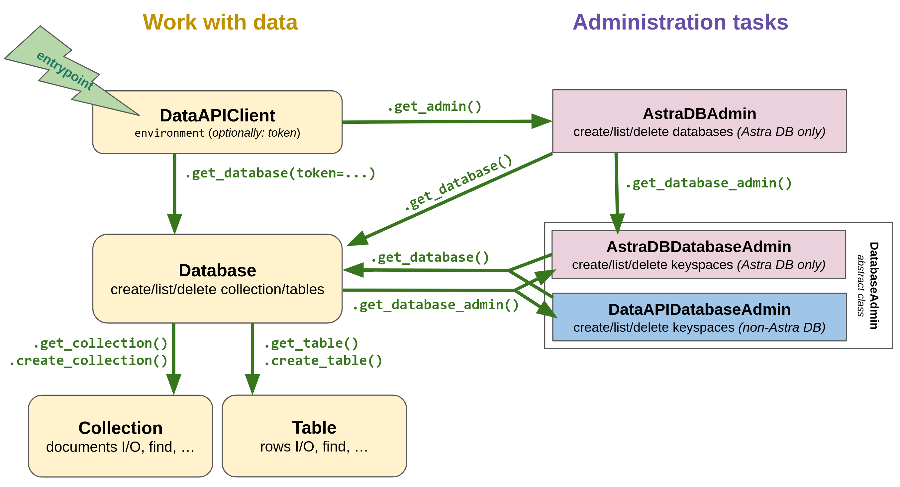

# AstraPy

A pythonic client for [DataStax Astra DB](https://astra.datastax.com).

_This README targets AstraPy version **1.0.0+**, which introducesa a whole new API. Click [here](https://github.com/datastax/astrapy/blob/cd3f5ce8146093e10a095709c0f5c3f8e3f2c7da/README.md) for the pre-existing API (fully compatible with newer versions)._


## Quickstart

Install with `pip install astrapy`.

Get the *API Endpoint* and the *Token* to your Astra DB instance at [astra.datastax.com](https://astra.datastax.com).

Try the following code after replacing the connection parameters:

```python
import astrapy


my_client = astrapy.DataAPIClient("AstraCS:...")
my_database = my_client.get_database_by_api_endpoint(
   "https://01234567-....apps.astra.datastax.com"
)

my_collection = my_database.create_collection(
    "dreams",
    dimension=3,
    metric=astrapy.constants.VectorMetric.COSINE,
)

my_collection.insert_one({"summary": "I was flying"}, vector=[-0.4, 0.7, 0])

my_collection.insert_many(
    [
        {
            "_id": astrapy.ids.UUID("018e65c9-e33d-749b-9386-e848739582f0"),
            "summary": "A dinner on the Moon",
        },
        {"summary": "Riding the waves", "tags": ["sport"]},
        {"summary": "Friendly aliens in town", "tags": ["scifi"]},
        {"summary": "Meeting Beethoven at the dentist"},
    ],
    vectors=[
        [0.2, -0.3, -0.5],
        [0, 0.2, 1],
        [-0.3, 0, 0.8],
        [0.2, 0.6, 0],
    ],
)

my_collection.update_one(
    {"tags": "sport"},
    {"$set": {"summary": "Surfers' paradise"}},
)

cursor = my_collection.find(
    {},
    vector=[0, 0.2, 0.4],
    limit=2,
    include_similarity=True,
)

for result in cursor:
    print(f"{result['summary']}: {result['$similarity']}")

# This would print:
#   Surfers' paradise: 0.98238194
#   Friendly aliens in town: 0.91873914
```

Next steps:

- More info and usage patterns are given in the docstrings of classes and methods
- [AstraPy reference](https://docs.datastax.com/en/astra/astra-db-vector/clients/python.html)
- [Data API reference](https://docs.datastax.com/en/astra/astra-db-vector/api-reference/data-api-commands.html)
- Package on [PyPI](https://pypi.org/project/astrapy/)

## AstraPy's API

### Abstraction diagram

AstraPy's abstractions for working at the data and admin layers are structured
as depicted by this diagram:



Here's a small admin-oriented example:

```python
import astrapy

my_client = astrapy.DataAPIClient("AstraCS:...")

my_astra_admin = my_client.get_admin()

database_list = list(my_astra_admin.list_databases())

db_info = database_list[0].info
print(db_info.name, db_info.id, db_info.region)

my_database_admin = my_astra_admin.get_database_admin(db_info.id)

my_database_admin.list_namespaces()
my_database_admin.create_namespace("my_dreamspace")
```

### Exceptions

The package comes with its own set of exceptions, arranged in this hierarchy:


For more information, and code examples, check out the docstrings and consult
the API reference linked above.

### Working with ObjectIds and UUIDs

Astrapy repackages the ObjectId from `bson` and the UUID class and utilities
from the `uuid` package and its `uuidv6` extension. You can also use them directly.

Even when setting a default ID type for a collection, you still retain the freedom
to use any ID type for any document:

```
import astrapy
import bson

my_collection = my_database.create_collection(
    "ecommerce",
    default_id_type=astrapy.constants.DefaultIdType.UUIDV6,
)

my_collection.insert_one({"_id": astrapy.ids.ObjectId("65fd9b52d7fabba03349d013")})
my_collection.find({
    "_id": astrapy.ids.UUID("018e65c9-e33d-749b-9386-e848739582f0"),
})

my_collection.update_one(
    {"tag": "in_stock"},
    {"$set": {"inventory_id": bson.objectid.ObjectId()}},
    upsert=True,
)

my_collection.insert_one({"_id": astrapy.ids.uuid8()})
```

## For contributors

First install poetry with `pip install poetry` and then the project dependencies with `poetry install`.

Linter, style and typecheck should all pass for a PR:

```
poetry run black --check astrapy && poetry run ruff astrapy && poetry run mypy astrapy

poetry run black --check tests && poetry run ruff tests && poetry run mypy tests
```

Features must be thoroughly covered in tests (see `tests/idiomatic/*` for
naming convention and module structure).

### Running tests

Full testing requires environment variables:

```
export ASTRA_DB_APPLICATION_TOKEN="AstraCS:..."
export ASTRA_DB_API_ENDPOINT="https://.......apps.astra.datastax.com"

export ASTRA_DB_KEYSPACE="default_keyspace"
# Optional:
export ASTRA_DB_SECONDARY_KEYSPACE="..."
```

Tests can be started in various ways:

```bash
# test the core modules
poetry run pytest tests/core
# test the "idiomatic" layer
poetry run pytest tests/idiomatic
poetry run pytest tests/idiomatic/unit
poetry run pytest tests/idiomatic/integration

# remove logging noise:
poetry run pytest [...] -o log_cli=0

# do not drop collections:
TEST_SKIP_COLLECTION_DELETE=1 poetry run pytest [...]

# include astrapy.core.ops testing (must cleanup after that):
TEST_ASTRADBOPS=1 poetry run pytest [...]
```

## Appendix: quick reference for imports

Client, data and admin abstractions:

```python
from astrapy import (
    DataAPIClient,
    Database,
    AsyncDatabase,
    Collection,
    AsyncCollection,
    AstraDBAdmin,
    AstraDBDatabaseAdmin,
)
```

Constants for data-related use:

```python
from astrapy.constants import (
    ReturnDocument,
    SortDocuments,
    VectorMetric,
    DefaultIdType,
)
```

ObjectIds and UUIDs:

```python
from astrapy.ids import (
    ObjectId,
    uuid1,
    uuid3,
    uuid4,
    uuid5,
    uuid6,
    uuid7,
    uuid8,
    UUID,
)
```

Operations (for `bulk_write` collection method):

```python
from astrapy.operations import (
    BaseOperation,
    InsertOne,
    InsertMany,
    UpdateOne,
    UpdateMany,
    ReplaceOne,
    DeleteOne,
    DeleteMany,
    AsyncBaseOperation,
    AsyncInsertOne,
    AsyncInsertMany,
    AsyncUpdateOne,
    AsyncUpdateMany,
    AsyncReplaceOne,
    AsyncDeleteOne,
    AsyncDeleteMany,
)
```

Result classes:

```python
from astrapy.results import (
    OperationResult,
    DeleteResult,
    InsertOneResult,
    InsertManyResult,
    UpdateResult,
    BulkWriteResult,
)
```

Exceptions:

```python
from astrapy.exceptions import (
    DevOpsAPIException,
    DataAPIErrorDescriptor,
    DataAPIDetailedErrorDescriptor,
    DataAPIException,
    DataAPITimeoutException,
    CursorIsStartedException,
    CollectionNotFoundException,
    CollectionAlreadyExistsException,
    TooManyDocumentsToCountException,
    DataAPIFaultyResponseException,
    DataAPIResponseException,
    CumulativeOperationException,
    InsertManyException,
    DeleteManyException,
    UpdateManyException,
    BulkWriteException,
)
```

Info/metadata classes:

```python
from astrapy.info import (
    AdminDatabaseInfo,
    DatabaseInfo,
    CollectionInfo,
)
```

Admin-related classes and constants:

```python
from astrapy.admin import (
    Environment,
    ParsedAPIEndpoint,
)
```

Cursors:

```python
from astrapy.cursors import (
    BaseCursor,
    Cursor,
    AsyncCursor,
    CommandCursor,
    AsyncCommandCursor,
)
```
